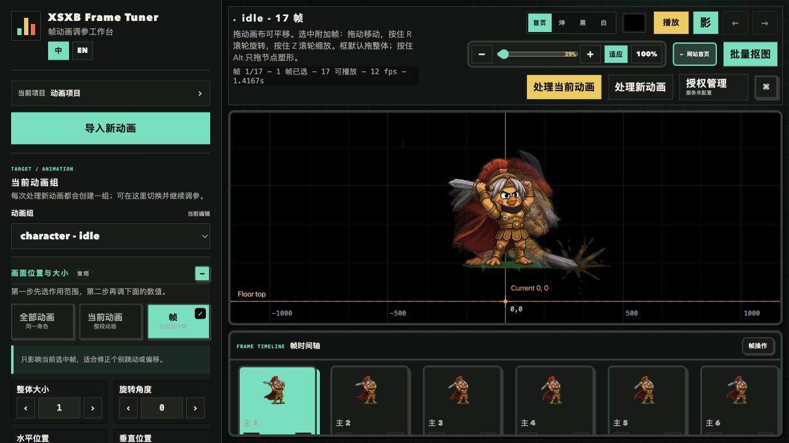
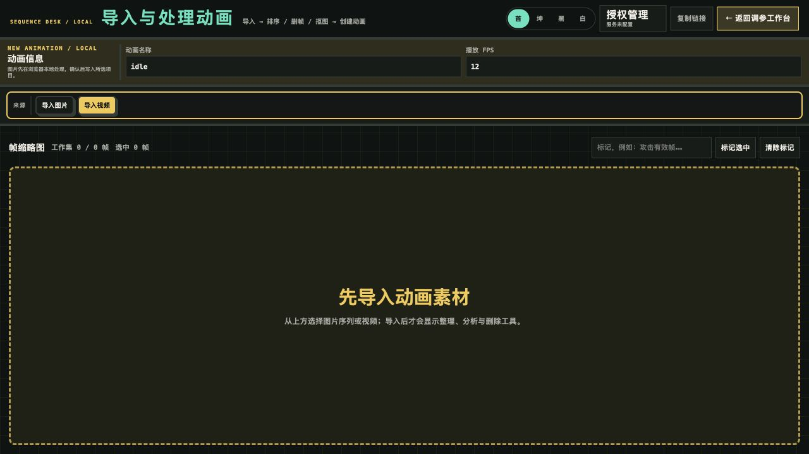
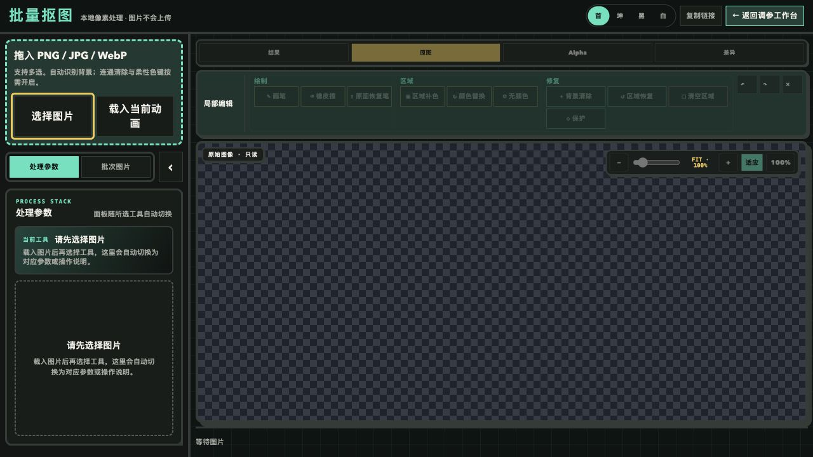
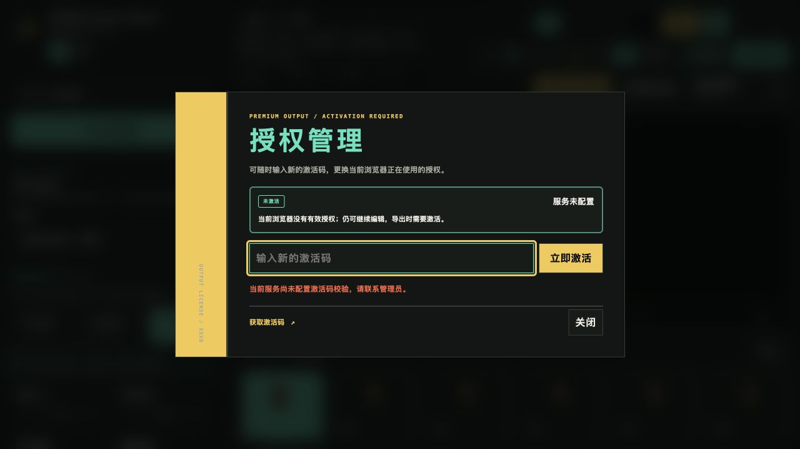

# XSXB Frame Tuner Pro 激活码

> Godot 2D 帧动画调参、序列整理与批量抠图工作台  
> 本商品为虚拟激活码，用于解锁已使用 Pro 高级能力的动画包导出授权。

## 一、可直接上架的商品文案

### 商品标题（推荐）

XSXB Frame Tuner Pro 激活码｜Godot 2D 帧动画调参·批量抠图·碰撞框·音效/VFX

### 短标题

XSXB Frame Tuner Pro 激活码｜帧动画调参工作台

### 一句话卖点

把散乱的图片序列或视频帧，整理成可预览、可调参、可复用的动画包。

### 商品简介

XSXB Frame Tuner 是面向 Godot 2D 帧动画制作的本地优先工作台。它把图片序列导入、视频取帧、帧排序与删减、批量抠图、逐帧调参、碰撞框、音效和图片挂件等流程集中到一个可视化界面中。

素材处理主要在本机浏览器中完成。导入、基础处理、调参和本地保存无需激活；当导出的动画实际使用了 Pro 高级能力时，系统才会校验授权。购买并激活后，即可在授权有效期内继续完成相关动画包导出。

### 核心卖点

1. **一站式帧动画流程**  
   支持图片序列与视频帧导入，从素材整理、预览、处理到动画包导出，减少多工具来回切换。

2. **可视化逐帧调参**  
   可按角色、动画组或单帧调整缩放、位置、旋转、禁用状态与播放时长，适合修正抖动、偏移和节奏问题。

3. **批量抠图与边缘修复**  
   支持背景清除、边缘增强、去污、Alpha 控制、颜色保护、局部修复和跨帧修复传播。

4. **面向游戏制作的高级数据**  
   支持逐帧碰撞框、帧音效、图片挂件与 VFX 图层，让动画数据更接近实际游戏运行需求。

5. **本地优先，素材更安心**  
   图片和视频由用户主动选择，核心处理流程在本机浏览器中完成，减少原始素材反复上传。

6. **按实际使用的 Pro 能力校验**  
   基础导入、编辑和保存不强制激活；只有导出内容确实使用 Pro 高级能力时才需要有效授权。

### Pro 高级能力范围

- 边缘增强、去污与颜色恢复
- 高级 Alpha、柔性色键与连通清除
- 颜色保护与保护区域
- 局部画笔、区域修复与颜色替换
- 跨帧智能修复传播
- 跳变帧与重复帧智能分析
- 智能循环段查找
- 逐帧碰撞框调校
- 帧音效绑定
- 图片挂件与 VFX 图层
- 逐帧时长与高级播放覆盖

> 说明：通用导入和未使用 Pro 能力的普通导出不属于强制付费范围。最终以软件导出时显示的功能清单为准。

### 适合人群

- Godot 2D 游戏开发者
- 独立游戏开发者与小型工作室
- 像素动画、序列帧动画制作人员
- 需要批量抠图、帧整理和碰撞框调校的美术或技术美术
- 希望用可视化工具降低动画接入成本的开发团队

### 商品规格填写模板

- 商品类型：虚拟商品 / 软件激活码
- 授权设备数：以当前购买规格为准（例如 1 台、3 台或不限设备）
- 授权有效期：以当前购买规格为准（例如 30 天、1 年或永久）
- 交付内容：XSXB Frame Tuner Pro 激活码 × 1
- 发货方式：购买后按店铺页面说明自动或人工发放
- 使用入口：按发货说明提供的工作台地址或安装说明进入

## 二、购买前请确认

1. 本商品为 **XSXB Frame Tuner Pro 激活码**，不包含角色素材、音效素材、Godot 项目源码、软件源码或定制开发服务。
2. 授权设备数量和有效期以所选商品规格为准；不同规格请分别标明，避免误购。
3. 同一设备重复激活通常不会重复占用设备名额；设备名额已满时，需要按界面提示解绑或替换已有设备。
4. 浏览器授权依赖当前浏览器的本地设备身份。请尽量使用常用浏览器，不要随意清理该站点数据或长期使用无痕模式。
5. 更换电脑、重装系统或清理浏览器数据前，建议先在“授权管理”中解绑当前设备。
6. 虚拟商品具有即时交付和可复制性。激活后通常不支持无理由退换；如遇激活码本身无法使用，请保留订单信息和错误截图联系售后核验。
7. 建议使用最新版 Chrome 或 Microsoft Edge。使用本地版时需安装 Node.js 18 或更高版本。

## 三、图文使用说明

### 第 1 步：进入工作台

按发货说明打开 XSXB Frame Tuner。进入工作台后，可在左侧查看当前项目与动画组，在中间画布预览动画，在底部时间轴选择具体帧。

**界面区域说明**

- 左侧：项目、动画组、调整范围、位置、缩放、旋转及高级功能
- 中间：动画预览画布，可缩放、平移并查看参考帧
- 底部：帧时间轴，可选择帧并调整逐帧时长
- 右上：播放、主题、批量抠图、处理动画、授权管理和导出入口

### 第 2 步：导入图片序列或视频

点击左侧“导入新动画”，填写动画名称与播放 FPS，然后选择“导入图片”或“导入视频”。

**导入建议**

- 图片序列建议提前按播放顺序命名，例如 `idle_001.png`、`idle_002.png`
- 视频导入后先选择片段，再设置 1–60 FPS 提取帧
- 导入前确认画面尺寸、透明背景和角色朝向是否一致

### 第 3 步：整理帧序列

导入后可进行排序、删帧、恢复源顺序、水平翻转、帧标记和循环分析。建议先删除重复帧和明显跳变帧，再进入抠图或调参。

**推荐顺序**

1. 核对总帧数和播放顺序
2. 设置动画名称与 FPS
3. 删除空白、重复或错误帧
4. 预览循环是否自然
5. 确认后创建或更新动画组

### 第 4 步：批量抠图

点击“批量抠图”，选择图片或载入当前动画。可根据素材背景使用自动取色、连通清除、Alpha 调整、去污、边缘修复和局部修正。

**操作建议**

- 先用低强度参数观察轮廓，再逐步增加边缘或 Alpha 强度
- 头发、武器特效和半透明区域建议放大检查
- 颜色与背景接近时，先添加颜色保护，再执行背景清除
- 只修正少数帧时，可用局部画笔；同类问题重复出现时，再使用跨帧传播

### 第 5 步：调整动画

返回工作台，在左侧先选择作用范围：

- **全部动画**：同一角色的所有动画一起调整
- **当前动画**：只影响当前动画组
- **帧**：只影响当前选中帧

随后调整缩放、旋转、水平位置、垂直位置与逐帧时长。需要时可设置参考帧、禁用异常帧、添加碰撞框、音效或图片挂件。

> 推荐先做角色级整体对齐，再做动画组级修正，最后只对个别异常帧进行微调。

### 第 6 步：输入激活码

点击右上角“授权管理”，在激活码输入框中粘贴收到的激活码，然后点击“立即激活”或“激活并继续”。

**激活成功后**

- 页面会显示当前授权状态和到期时间
- 试用授权会显示剩余有效期
- 付费授权会显示当前激活码对应的有效期
- 设备名额已满时，按提示选择要替换的设备

### 第 7 步：保存并导出

完成调整后先点击“保存调参”，再使用“导出动画包”或对应工具的“导出 ZIP”。

- 未使用 Pro 高级能力：可直接导出
- 已使用 Pro 高级能力：系统会校验当前授权
- 未激活或授权到期：当前编辑不会丢失，输入有效激活码后可继续导出

导出前建议再次核对动画名称、帧数、FPS、循环效果、透明边缘、碰撞框和逐帧时长。

## 四、常见问题

### 1. 不购买激活码可以使用吗？

可以。导入、基础处理、调参和本地保存不要求激活；导出的动画实际使用 Pro 高级能力时，才需要有效授权。

### 2. 激活后能在几台设备使用？

以购买的设备规格为准。同一设备重复激活通常不重复占用名额；新设备超过名额时，需要解绑或替换已有设备。

### 3. 为什么换浏览器后需要重新激活？

授权与浏览器设备身份关联。更换浏览器、清除站点数据、使用无痕模式或重装系统都可能生成新的设备身份。

### 4. 激活码到期后编辑内容会丢失吗？

不会因到期自动删除当前编辑内容。授权到期后仍可编辑，涉及 Pro 高级能力的导出需要重新激活或续期。

### 5. 素材会上传到服务器吗？

工作台采用本地优先设计，图片和视频由用户主动选择，核心素材处理在本机浏览器中完成。具体网络与部署行为以实际使用版本和服务说明为准。

### 6. 激活失败怎么办？

请依次检查：

1. 激活码前后是否有多余空格
2. 是否使用了正确的商品规格和工作台入口
3. 设备名额是否已满
4. 授权是否已到期或被管理员撤销
5. 网络是否正常

仍无法激活时，请提供订单号、激活时间、浏览器名称和错误截图联系售后。请勿在公开群聊中发送完整激活码。

## 五、客服快捷回复

### 发货回复

您好，本商品为 XSXB Frame Tuner Pro 虚拟激活码。请按发货说明进入工作台，点击右上角“授权管理”，粘贴激活码并点击“立即激活”。授权设备数和有效期以您购买的规格为准。

### 激活失败回复

您好，请先确认激活码前后没有空格，并检查设备名额是否已满。如果仍无法激活，请发送订单号、浏览器名称和完整错误截图；为保护授权安全，请不要在公开群聊中发送完整激活码。

### 换机回复

您好，更换电脑、浏览器或清理站点数据前，请先在原设备的“授权管理”中解绑当前设备。若原设备已无法使用，请发送订单信息和设备情况，我们会协助核验授权名额。

